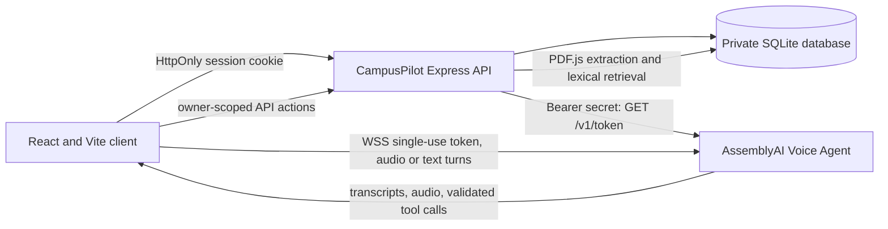

# CampusPilot AI

CampusPilot is a separate voice-first academic assistant project. Its source, dependencies, backend, configuration, and documentation live entirely in this folder. It does not import from or modify AI Student Hub.

## Features

- Live browser voice conversations with the AssemblyAI Voice Agent API when a valid backend key is configured.
- Spoken assistant audio, live transcripts, interruption handling, explicit session end, and microphone cleanup.
- SQLite-backed accounts, profiles, private conversations, study tasks/sessions, documents, quizzes, and attempts.
- Authenticated task CRUD and voice-callable task/document/quiz actions.
- Private PDF text extraction, chunk indexing, lexical BM25-style retrieval, and source page/name results.
- A persisted quiz history with server-side answer scoring, plus a separate deterministic demo quiz.
- A local-only guest planner and clearly labeled local text samples when signed out or in demo mode.
- Demo mode works without an AssemblyAI key and never submits the placeholder.

## Architecture



AssemblyAI provides live speech understanding, the managed conversation model, and spoken responses. The client uses the documented short-lived browser token flow and event protocol; the permanent API key stays on the backend. SQLite stores account data on the CampusPilot server. PDF retrieval uses page-aware text chunks and BM25-style term ranking; it does not use embeddings or an external vector database.

Official references: [Browser integration](https://www.assemblyai.com/docs/voice-agents/voice-agent-api/browser-integration), [Events reference](https://www.assemblyai.com/docs/voice-agents/voice-agent-api/events-reference), and [Client-side tools](https://www.assemblyai.com/docs/voice-agents/voice-agent-api/tools/client-side-tools).

## Requirements

- Node.js 22.12+ (Vite 8 and the live smoke test's WebSocket client).
- npm.
- A modern browser with microphone access for live voice.
- An AssemblyAI API key for live sessions; not needed for demo mode.

## Install and Run

From the workspace root, enter this project:

```powershell
cd CampusPilot
npm install
Copy-Item .env.example .env
npm run dev
```

Vite serves the frontend at `http://localhost:5174`; the isolated Express API listens at `http://127.0.0.1:5001`. Vite proxies `/api` requests to this local backend. These ports are distinct from the AI Student Hub ports.

To run processes separately, use two terminals in this folder:

```powershell
npm run dev:server
npm run dev:client
```

Production build, preview, tests, and lint:

```powershell
npm run build
npm run preview
npm test
npm run lint
```

The production build outputs to this project's `dist/`. The Express server serves that folder when built.

## Public Deployment

This project is ready to host as a single Node web service. The simplest approach is Render:

1. Push this folder to GitHub.
2. Create a new Render Web Service from the repository.
3. Use the included `render.yaml` config, or set the service start command to `npm start` and the build command to `npm install && npm run build`.
4. Add these environment variables in the Render dashboard:
   - `NODE_ENV=production`
   - `PORT=10000`
   - `FRONTEND_URL=https://<your-render-domain>`
   - `AUTH_SECRET=<strong-random-secret>`
   - `ASSEMBLYAI_API_KEY=<your-live-key>`
5. Trigger deploy and verify `https://<your-render-domain>/api/health` responds successfully.

A container-based alternative is also included via the root `Dockerfile` for providers that build from containers instead of a Node service.

## Environment and API Key

The backend reads the key from this folder's `.env` only:

```dotenv
ASSEMBLYAI_API_KEY=YOUR_ASSEMBLYAI_API_KEY_HERE
NODE_ENV=development
PORT=5001
FRONTEND_URL=http://localhost:5174
AUTH_SECRET=REPLACE_WITH_A_LONG_RANDOM_SECRET
```

Replace the placeholder yourself in `CampusPilot/.env`, then restart `npm run dev` or `npm run dev:server`. The real key must never be put in a `VITE_*` variable, source code, browser storage, screenshots, logs, or the repository. `.gitignore` excludes `.env` files and retains `.env.example`.

The backend issues a single-use token with a five-minute redemption window and a 30-minute session cap from the official `GET https://agents.assemblyai.com/v1/token` endpoint. The browser receives only this temporary token and opens `wss://agents.assemblyai.com/v1/ws?token=...`. Status validation also requests and discards a temporary token to verify the configured key; it does not start a voice session. `AUTH_SECRET` must be replaced with a long random secret before production; development uses a local-only fallback when the placeholder remains.

## API

- `GET /api/health`: local backend health.
- `GET /api/status`: reports `demo`, `live`, or `unavailable`; does not return credentials.
- `POST /api/auth/signup`, `/login`, `/logout`: standalone account management with bcrypt passwords and HttpOnly session cookies.
- `GET /api/auth/me`, `GET/PUT /api/auth/profile`: current account and profile/preferences.
- `GET/POST /api/tasks`, `PATCH/DELETE /api/tasks/:id`: owner-scoped task CRUD; delete requires confirmation.
- `GET/POST /api/tasks/sessions`: study session history.
- `GET/POST /api/conversations`, `GET/POST/DELETE /api/conversations/:id`: owner-scoped messages/history; delete requires confirmation.
- `GET/POST/DELETE /api/documents`, `POST /api/documents/search`: validated PDF processing, private listing/deletion, page-aware retrieval.
- `GET/POST /api/quizzes`, `GET /api/quizzes/:id`, `POST /api/quizzes/:id/attempts`: persisted quizzes and server-validated attempts.
- `POST /api/voice-token`: authenticated and rate-limited; returns a temporary token with `Cache-Control: no-store`.

State-changing authenticated requests require the HttpOnly session cookie, an allowed Origin, and the CampusPilot request header. Account queries scope records by authenticated user ID. CORS is not treated as authentication.

## Demo Mode

When the key is missing or is `YOUR_ASSEMBLYAI_API_KEY_HERE`, the backend reports demo mode and makes no AssemblyAI request with that value. Guest-local tasks, sample typed explanations, and the fixed three-question quiz remain usable. Signed-in task/document/quiz storage works independently of AssemblyAI. Sample replies and the fixed quiz are not AI-generated. The mode banner does not claim a live connection.

To test demo mode, leave the placeholder unchanged, run `npm run dev`, and open the URL shown above. Confirm the demo banner, add a task, complete it, refresh, and verify that it remains in this browser. Typed sample replies and the local quiz need no key.

## Live Voice Verification

1. Put your key in this project's `.env` and restart the backend.
2. Open `http://localhost:5001/api/status`; it should report `live` if AssemblyAI accepts the key.
3. Sign up or sign in, then open `http://localhost:5174`.
4. Send a typed question to verify the live text turn, transcript, and spoken response.
5. Choose **Start voice assistant**, grant microphone access, speak, and interrupt a response.
6. Select **End session** and confirm microphone/audio resources are cleaned up.
7. Ask to create or list tasks; confirm account-backed changes in the planner.

Live audio is sent to AssemblyAI while a mic session is active. The app does not store raw audio. Signed-in transcripts are persisted in the local SQLite database; provider processing and retention follow AssemblyAI's service terms. The opt-in live smoke check uses a short text-only session and a temporary database.

## Privacy and Security

- Permanent key is read only by the local Express backend.
- The server validates missing/placeholder keys and sanitizes provider failures.
- Auth uses bcrypt password hashes, signed HttpOnly cookies, Origin/custom-header checks, and rate limits.
- Token, auth, PDF upload, and document search endpoints have rate limits; token responses are not cacheable.
- Browser capture starts only after the explicit start button and microphone permission.
- PCM is resampled to 24 kHz in an AudioWorklet; microphone tracks and audio contexts are stopped on session end/unmount.
- PDFs are parsed as untrusted data; JavaScript evaluation is disabled, uploads are size/type/signature checked, and queries filter by account owner.
- SQLite data and extracted document text stay on the server and are excluded by `.gitignore`.
- Before public deployment, set a strong unique `AUTH_SECRET`, review SQLite backup/retention, configure HTTPS/CORS, and review provider retention settings.

## Current Scope and Limitations

Implemented: standalone accounts/profile, SQLite persistence, owner-scoped task/session/conversation/document/quiz APIs, task CRUD, PDF text extraction and page-aware BM25 retrieval, persisted AI quiz definitions/attempt scoring, live AssemblyAI audio and typed turns, reconnect via documented resume, and browser-local demo fallback.

Not implemented: vector embeddings/semantic retrieval, OCR for scanned PDFs, automatic multi-day plan generation, calendar integration, external opportunity search, AI Student Hub catalog search, MFA/email verification/password reset, cross-device database sync/hosted database, full automated browser test framework, deployment, demo video, cover art, slide deck, or public repository setup. Quiz generation requires an authenticated live assistant session; the fixed sample quiz is not AI-generated. Do not claim educational outcome metrics.

## Tests

`npm test` uses Node's built-in test runner with a temporary SQLite database and checks placeholder blocking, auth, ownership boundaries, task CRUD, conversation isolation, quiz scoring, malformed PDF rejection, and sanitized provider errors. `npm run test:live-voice` is opt-in: it uses the real configured key for a brief text-only AssemblyAI session, then ends the session and deletes its temporary database. It does not test physical microphone permission; verify that manually in a browser.
